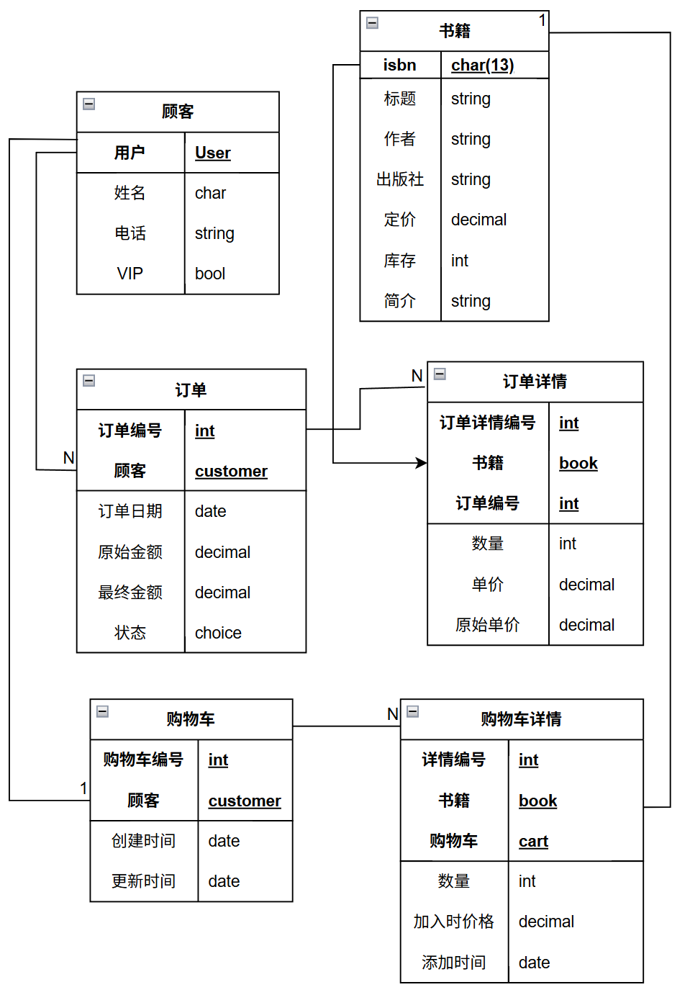

# 书店销售管理系统

## 概要

使用Django开发的B/S数据库管理系统，学习[MDN的教程](https://github.com/mdn/django-locallibrary-tutorial)做的

基本是不能用，只是演示功能

模型如下


## 开始

```bash
cd BookstoreSalesManagementSystem
# 安装依赖
pip3 install -r requirement.txt
# 添加数据
cd BookstoreSalesManagementSystem
python3 manage.py makemigrations
python3 manage.py migrate
python3 manage.py import_books data/data.json
# 创建用户
python3 manage.py createsuperuser
# 运行服务器
python3 manage.py runserver
```

- 在网页`127.0.0.1`可以看到主界面

- 在网页`127.0.0.1:8000/admin`进入管理员界面

## 存在问题

- 购物车有书籍情况下，登录会将书籍同步到账户的购物车，但是是覆盖而不是添加，也就是说原来购物车中的物品会丢失并且库存也不会退回

- 匿名状态下添加图书会扣减库存添加到购物车，但是不会自动退回库存，会一直存在购物车中，清除缓存应该也没有用
